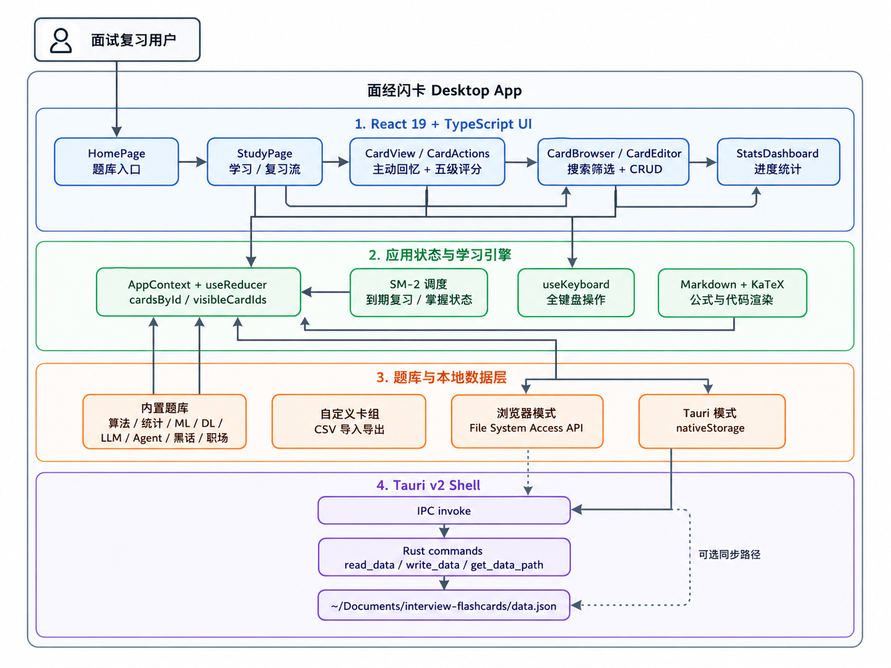

# 📚 Interview Flashcards — 面经闪卡

<p align="center">
  <a href="https://github.com/lzzzhh/interview-flashcards/actions/workflows/build.yml"></a>
  <a href="LICENSE"></a>
  
  
  
  
  
  
</p>

<p align="center">
  
</p>

<p align="center">
  Active Recall + SM-2 间隔重复驱动的面试复习桌面应用。<br>
  <b>AI 智能搜索</b> · <b>学习清单生成</b> · <b>向量语义匹配</b><br>
  内置卡片覆盖算法 · 统计学 · 机器学习 · 深度学习 · 大模型 · Agent · Vibe Coding · 行业黑话 · 职场话术。
</p>

---

## 快速开始

```bash
curl -fsSL https://raw.githubusercontent.com/lzzzhh/interview-flashcards/main/install.sh | bash
```

或从 [Releases](https://github.com/lzzzhh/interview-flashcards/releases) 下载：

| 平台 | 安装包 |
|------|--------|
| 🍎 macOS (Apple Silicon) | `面经闪卡_aarch64.dmg` |
| 🍎 macOS (Intel) | `面经闪卡_x86_64.dmg` |
| 🪟 Windows | NSIS `.exe` 安装包 |
| 🐧 Linux | `.deb` 安装包 |

---

## 功能亮点

### 🏠 全新首页设计

三栏式首页：今日待完成 → 推荐学习 → 我的牌组，底部 Tab Bar 导航。

- **今日待完成**：复习 / 新卡 / 学习中 实时统计，一键开始今日学习
- **推荐学习**：SM-2 算法智能推荐最需复习的卡片，支持左右滑动和点击跳转
- **我的牌组**：9 个内置模块 + 自定义牌组，显示复习/新卡数量
- **底部 Tab Bar**：首页 / 全部牌组 / 学习统计 / 我的

### 🧠 主动回忆 + 间隔重复

卡片默认隐藏答案，先回忆、再揭示。算法题支持「思路」和「代码」独立展开，问答题支持 Markdown + LaTeX 渲染。

- **增强版 SM-2 调度** — 记录 `new / learning / review / relearning` 状态
- **五级评分系统** — 按钮实时显示预期间隔：`<1天`、`3天`、`2周`、`1月`
- **到期复习队列** — 复习模式只展示到期卡片，新卡模式每日上限控制
- **撤回上次评分** — `Ctrl/Cmd + Z` 回滚

### 📊 九大内置模块

| 模块 | 覆盖范围 |
|------|----------|
| 🔥 力扣 | Hot 100 |
| 📊 统计学 | 描述统计、概率论、假设检验、贝叶斯等 |
| 🤖 机器学习 | 监督/无监督、集成学习、特征工程等 |
| 🧩 深度学习 | 神经网络训练、生成模型等 |
| 🧠 大模型 | Transformer、RAG、训练微调等 |
| 🤖 Agent | Agent 架构、工具调用、记忆等 |
| 🔮 Vibe Coding | /command、Skill、Agent Team、MCP、Hooks 等 |
| 💬 黑话 | 互联网黑话、职场术语 |
| 👔 职场 | 向上沟通、面试技巧等 |

### 🔍 AI 智能搜索（需要后端 + Ollama）

基于 bge-m3 向量嵌入的语义搜索，支持中文自然语言查询，自动匹配最相关的面试卡片。

- **多路召回**：FTS5 全文搜索 + 标签匹配 + 语义向量检索
- **智能排序**：字段加权 + 学习状态 Boost + 牌组匹配度
- **语义理解**：同义词、中英混合、自然语言查询

### 📋 AI 学习清单

搜索后输入学习意图（如「学习决策树」「想掌握 SVM」），AI 自动筛选相关卡片并按学习优先级排序生成学习计划。清单保存在本地，可在「我的 → 学习清单」中查看和跳转学习。

### 🗄️ 向量数据库

可视化向量存储管理，支持多模块切换，实时查看嵌入记录与语义搜索结果。

### 📈 学习统计

独立统计页，展示：

- 总卡片、已掌握、待复习
- 连续学习天数、今日已学
- 掌握率进度条、复习阶段分布
- 模块分布进度条
- 每日新卡上限（可折叠）
- 数据导出 / 导入（覆盖全部模块 + 自定义牌组）

### 🎹 快捷键

| 快捷键 | 功能 |
|--------|------|
| `←` `→` | 翻页 |
| `Space` | 显示 / 隐藏答案 |
| `1` – `5` | 评分 |
| `D` | 切换深色模式 |
| `Ctrl/Cmd + Z` | 撤回评分 |

---

## 技术栈

| 层级 | 技术选型 |
|------|----------|
| 前端 | React 19 + TypeScript + Vite 8 |
| 样式 | TailwindCSS v4 + CSS 变量主题 |
| 数学渲染 | react-markdown + KaTeX |
| 图标 | lucide-react |
| 桌面框架 | Tauri v2 (Rust) |
| **后端 API** | **Fastify + Prisma + SQLite** |
| 向量嵌入 | bge-m3 via Ollama (本地部署) |
| 全文搜索 | SQLite FTS5 + 中文 bigram 分词 |
| 间隔重复 | SM-2 算法（前后端双份，后端优先） |
| CI/CD | GitHub Actions (macOS/Win/Linux) |

## 架构

<p align="center">
  
</p>

```
┌─────────────────────────────────────────────────────┐
│                    Tauri 桌面壳                       │
│  ┌───────────────────────────────────────────────┐  │
│  │              React 前端 (SPA)                  │  │
│  │  ┌─────────┐ ┌────────┐ ┌──────────────────┐  │  │
│  │  │ HomePage │ │StudyPage│ │ Stats/Deck/      │  │  │
│  │  │         │ │        │ │ Profile/Search   │  │  │
│  │  └────┬─────┘ └───┬────┘ └────────┬─────────┘  │  │
│  │       │            │              │             │  │
│  │  ┌────▼────────────▼──────────────▼─────────┐  │  │
│  │  │         Repository / API Client          │  │  │
│  │  └────────────────────┬─────────────────────┘  │  │
│  └───────────────────────┼────────────────────────┘  │
│                          │                           │
│  ┌───────────────────────▼────────────────────────┐  │
│  │         原生存储 (Rust fs / localStorage)       │  │
│  └────────────────────────────────────────────────┘  │
└─────────────────────────────────────────────────────┘
                          │
                          ▼
┌─────────────────────────────────────────────────────┐
│              后端 API (Fastify :3001)                │
│  ┌──────────┐ ┌────────┐ ┌──────────┐ ┌─────────┐  │
│  │ /api/    │ │ /api/  │ │ /api/    │ │ /api/   │  │
│  │  decks   │ │ cards  │ │ reviews  │ │ study   │  │
│  └────┬─────┘ └───┬────┘ └────┬─────┘ └────┬────┘  │
│  ┌────┴─────┐ ┌────┴───────────────────────────┐  │
│  │ /api/    │ │ /api/search (AI 搜索 + 学习清单) │  │
│  │ settings │ │ /api/maintenance (向量数据库)    │  │
│  └────┬─────┘ └────┬───────────────────────────┘  │
│       │            │           │            │       │
│  ┌────▼────────────▼───────────▼────────────▼────┐  │
│  │              Prisma ORM                        │  │
│  └────────────────────┬───────────────────────────┘  │
│                       │                              │
│  ┌────────────────────▼───────────────────────────┐  │
│  │              SQLite / PostgreSQL               │  │
│  └────────────────────────────────────────────────┘  │
└─────────────────────────────────────────────────────┘
```

## 从源码构建

```bash
git clone https://github.com/lzzzhh/interview-flashcards.git
cd interview-flashcards
npm install

# 启动后端（可选，用于数据库功能）
cd backend && npm install && npm run dev

# 浏览器开发
npm run dev

# 构建桌面安装包
npm run build:desktop
```

---

## 许可证

MIT License
