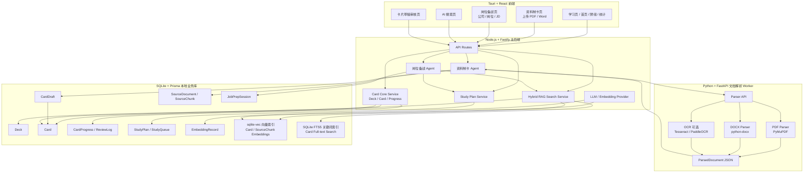

# Interview Flashcards 架构优化方案：Agent、RAG 与本地部署技术栈

> 版本：v1.0  
> 目标：在现有 Interview Flashcards 项目基础上，引入资料制卡 Agent、岗位备战 Agent、Hybrid RAG 搜索、向量索引与本地文档解析能力。  
> 最终技术栈：**Tauri 桌面端 + React 前端 + Node.js/Fastify 主后端 + SQLite/Prisma 本地业务库 + sqlite-vec 向量索引 + Python/FastAPI 文档解析 Worker**。

---

## 1. 背景与目标

当前项目已经具备以下基础能力：

- React + TypeScript + Tauri 桌面端；
- 内置面试闪卡数据；
- SM-2 间隔重复复习；
- 自定义牌组与用户卡片；
- 本地进度持久化；
- Fastify + Prisma + SQLite 后端雏形；
- 牌组、卡片、复习记录、学习队列等基础后端模型。

下一阶段目标不是简单加入一个聊天机器人，而是把项目升级为：

> **本地 AI 面试学习系统：支持资料上传生成题库、岗位 JD 匹配卡片、生成学习计划、语义搜索和未来模拟面试。**

核心新增能力包括：

1. **资料制卡 Agent**：用户上传 Word/PDF，系统解析内容并生成卡片草稿。
2. **岗位备战 Agent**：用户输入公司/岗位/JD，系统匹配已有题库并生成学习计划。
3. **Hybrid RAG 搜索**：结合向量搜索、关键词搜索、标签过滤与 SM-2 学习状态重排。
4. **本地文档解析 Worker**：通过 Python FastAPI Worker 处理 PDF/DOCX/OCR 等文档解析能力。
5. **高可扩展本地架构**：支持后续接入 MCP、模拟面试、OCR、网页抓取、题库缺口补全等能力。

---

## 2. 最终技术栈

```text
Tauri 桌面端
React + TypeScript 前端
Node.js + Fastify 主后端
SQLite + Prisma 本地业务库 + sqlite-vec 向量索引
Python + FastAPI 文档解析 Worker
```

### 2.1 技术职责划分

| 技术 | 职责 |
|---|---|
| **Tauri** | 桌面应用壳、本地应用分发、启动/管理本地服务 |
| **React + TypeScript** | 学习交互、资料上传、岗位备战、AI 搜索、草稿审核 |
| **Node.js + Fastify** | 主后端、业务 API、Agent 编排、RAG 搜索、数据库事务 |
| **SQLite + Prisma** | 本地业务主库，保存卡片、进度、草稿、计划、来源数据，内置 sqlite-vec 向量索引 |
| **Python + FastAPI Worker** | 文档解析服务，负责 PDF/DOCX/OCR 等解析任务 |

### 2.2 架构原则

1. **SQLite 是事实源**：所有真实业务数据都以 SQLite 为准。
2. **sqlite-vec 是搜索索引**：嵌入在 SQLite 中，只保存 embedding 和检索 metadata，可随时重建。
3. **Fastify 是主控层**：Agent 状态机、任务编排、业务逻辑都放在 Node 后端。
4. **Python Worker 是工具层**：只负责文档解析，不参与业务决策。
5. **前端只做交互**：React 不承载复杂 Agent 逻辑，只负责展示、输入、审核和学习。
6. **AI 生成卡片必须进草稿箱**：不能直接写入正式题库。
7. **模型能力不可假设**：文件解析、OCR、chunk、向量检索不能依赖用户配置的大模型。
8. **Agent 作为可插拔模块**：Agent 不与主后端耦合在同一进程内，通过 RESTful API 契约通信。Agent 不持有数据库连接、不写入磁盘、不依赖主后端内部类型，可独立启动/停止/替换。替换 Agent 实现只需适配同一套 API 契约。
9. **Provider 抽象层隔离实现**：LLM、Embedding、向量存储、数据库均通过 Provider 接口访问，更换实现无需修改业务代码。核心组件（CardCore、SearchService、Agent）只依赖抽象接口，不依赖具体实现类。更换 SQLite → PostgreSQL 仅需改 Prisma schema + 换 provider。
10. **模块间仅通过接口契约耦合**：每个模块只通过明确定义的接口与外界交互。主后端不知道 Agent 内部状态机怎么跑，Agent 不知道数据库是 SQLite 还是 PG，SearchService 不知道底层是 sqlite-vec 还是 Qdrant。模块替换时，契约不变就不影响其他模块。

---

## 3. 总体架构



---

## 4. 功能边界

当前阶段需要明确拆分三个核心模块：

```text
1. 资料制卡 Agent
   Word/PDF → 解析 → 卡片草稿 → 审核入库

2. 岗位备战 Agent
   公司/岗位/JD → 匹配已有题库 → 生成学习计划

3. Hybrid RAG 搜索
   向量搜索 + 关键词搜索 + 业务重排
```

这三个模块可以共享底层能力，但产品流程必须分开。

---

## 5. 资料制卡 Agent

### 5.1 功能定位

资料制卡 Agent 只处理：

```text
用户上传 Word / PDF / TXT / Markdown
  ↓
系统解析文本
  ↓
Agent 生成卡片草稿
  ↓
用户审核
  ↓
加入题库
```

它不负责：

- 找 JD；
- 分析岗位；
- 制定学习计划；
- 公司/岗位备战。

### 5.2 标准流程

```text
用户上传文件
  ↓
Fastify 创建 ingest job
  ↓
Python Worker 解析 PDF / DOCX
  ↓
返回 ParsedDocument JSON
  ↓
Node 后端 clean + chunk
  ↓
写入 SourceDocument / SourceChunk
  ↓
LLM 根据 chunks 生成 CardDraft
  ↓
去重 / 质量检查
  ↓
草稿箱展示
  ↓
用户审核通过
  ↓
写入正式 Card
  ↓
生成 Card embedding
  ↓
写入 sqlite-vec 向量索引
```

**原始文件管理：**

```text
- 用户上传的 PDF/Word 原始文件保存到 Tauri 应用缓存目录
- 解析完成后保留 7 天
- 草稿审核通过/拒绝后，原始文件可删除
- 用户在草稿审核页可下载原始文件，确认\"这份草稿是从哪来的\"
- 每份 SourceDocument 记录原始文件路径，便于回溯
```

### 5.3 文档解析职责

文档解析不依赖大模型。大模型只处理解析后的文本。

**Python Worker 边界约束：**

```text
Python Worker 必须保持无状态，不直接访问 SQLite，
不调用 LLM，不写入 CardDraft，不参与任何业务决策。
它只做一件事：把文件转换为标准 ParsedDocument JSON。
```

```text
Python Worker 负责：
- PDF 文本抽取
- DOCX 文本抽取
- OCR 可选
- 表格基础抽取，可后续增强
- 输出统一 ParsedDocument JSON

Node 后端负责：
- 文本清洗
- chunk 切分
- hash 去重
- source/chunk 入库
- 生成卡片草稿
```

### 5.4 Python Worker 推荐能力

第一版：

```text
PDF：PyMuPDF
DOCX：python-docx
OCR：暂时可选，后续接 Tesseract / PaddleOCR
```

统一输出：

```ts
interface ParsedDocument {
  id: string;
  fileName: string;
  sourceType: 'pdf' | 'docx' | 'txt' | 'md' | 'html';
  parser: 'python-worker';
  fullText: string;
  pages?: ParsedPage[];
  warnings: string[];
  textHash: string;
}

interface ParsedPage {
  pageNumber?: number;
  text: string;
  tables?: ParsedTable[];
  extractionMethod: 'text' | 'ocr';
  confidence?: number;
}
```

---

## 6. 岗位备战 Agent

### 6.1 功能定位

岗位备战 Agent 处理：

```text
公司 / 岗位 / JD
  ↓
解析岗位要求
  ↓
匹配已有题库
  ↓
生成学习计划
  ↓
创建学习队列
```

它不处理 Word/PDF 上传制卡。

### 6.2 多轮工作流

#### 情况 1：用户只输入公司

```text
用户：我准备面试京东
Agent：你准备面试京东的哪个岗位？例如数据科学、推荐算法、大模型应用、后端开发等。
```

此时不抓 JD，因为没有岗位，搜索范围太大。

#### 情况 2：用户输入公司 + 岗位

```text
用户：我准备面试京东的数据科学岗位，2-3 天内学完
```

Agent 执行：

```text
1. 识别公司：京东
2. 识别岗位：数据科学
3. 识别学习目标：2-3 天
4. 后台尝试搜索 JD
5. 同时提示用户：如果已有 JD，可以直接粘贴
6. 如果用户粘贴 JD，优先使用用户 JD，并取消后台 JD 搜索
7. 如果搜索到 JD，展示候选 JD，让用户确认
8. 解析 JD
9. 匹配已有题库
10. 生成学习计划
```

### 6.3 用户输入优先级

```text
用户粘贴 JD > 自动抓取 JD > 通用岗位画像
```

### 6.4 JD 与面经的区别

岗位备战 Agent 只使用 JD 做岗位画像。

```text
JD：用于岗位画像、题库匹配、学习计划
面经：不属于岗位备战主流程；如果要处理，应走资料制卡 Agent
```

### 6.5 状态机

```ts
type JobPrepState =
  | 'awaiting_company'
  | 'awaiting_role'
  | 'collecting_jd'
  | 'searching_jd'
  | 'awaiting_jd_choice'
  | 'awaiting_manual_jd'
  | 'analyzing_jd'
  | 'matching_cards'
  | 'generating_plan'
  | 'ready'
  | 'failed';
```

会话结构：

```ts
interface JobPrepSession {
  id: string;
  state: JobPrepState;

  company?: string;
  role?: string;
  location?: string;
  targetDays?: number;
  dailyMinutes?: number;
  interviewDate?: string;

  jdSearchTask?: {
    id: string;
    status: 'idle' | 'searching' | 'candidate_found' | 'cancelled' | 'failed';
    candidates?: JobPostingCandidate[];
  };

  chosenJD?: {
    source: 'manual' | 'web_search' | 'generic_profile';
    text: string;
    url?: string;
    confidence: number;
  };

  jobProfile?: JobProfile;
  cardMatches?: CardMatch[];
  studyPlan?: StudyPlan;
}
```

---

## 7. Hybrid RAG 搜索

### 7.1 为什么不是纯向量搜索

向量搜索适合语义召回，但不适合处理所有搜索需求。

因此应采用：

```text
Hybrid RAG
= 向量搜索
+ 关键词搜索
+ 标签过滤
+ 模块过滤
+ 难度过滤
+ SM-2 状态重排
+ 岗位相关度重排
```

### 7.2 搜索流程

```text
用户 query / JD 技能画像
  ↓
生成 query embedding
  ↓
sqlite-vec 向量召回 topK  （语义相似度）
  ↓
SQLite FTS5 关键词搜索 topK  （精确匹配，独立于向量搜索）
  ↓
合并候选 cardIds + dedup
  ↓
回 SQLite 查询完整 Card + CardProgress + Deck
  ↓
业务重排
  ↓
返回推荐卡片与推荐原因
```

### 7.3 FTS5 关键词搜索设计

关键词搜索使用 SQLite FTS5，与向量搜索并行独立执行。

FTS5 虚拟表设计：

```sql
-- Card 全文索引
CREATE VIRTUAL TABLE card_fts USING fts5(
  cardId UNINDEXED,
  deckId UNINDEXED,
  question,
  answer,
  tags,
  tokenize='unicode61 tokenchars'
);

-- 同步触发器：Card 写入/更新时自动同步 FTS5
CREATE TRIGGER card_fts_insert AFTER INSERT ON Card BEGIN
  INSERT INTO card_fts(cardId, deckId, question, answer, tags)
  VALUES (new.id, new.deckId, new.question, new.answer, new.tags);
END;
```

搜索时：

```sql
SELECT cardId, rank
FROM card_fts
WHERE card_fts MATCH ?
ORDER BY rank
LIMIT ?
```

同样为 `SourceChunk` 建立独立的 FTS5 表，用于资料段落级搜索。

FTS5 索引也遵循**可重建原则**：删除重建不影响业务数据。

### 7.4 重排因素

```text
最终分 =
  语义相似度
+ 关键词匹配分
+ JD 技能匹配分
+ 到期复习权重
+ 错题/遗忘权重
+ 收藏权重
+ 高频面试权重
+ 难度适配权重
```

### 7.5 搜索输入

```ts
interface CardSearchInput {
  query: string;
  topics?: string[];
  deckIds?: string[];
  topK: number;
  filters?: {
    difficulty?: string[];
    states?: string[];
    onlyDue?: boolean;
    includeWeakCards?: boolean;
    favoritedOnly?: boolean;
  };
}
```

### 7.6 搜索结果

```ts
interface CardMatch {
  cardId: string;
  title: string;
  deckId: string;
  tags: string[];
  score: number;
  matchType:
    | 'must_review'
    | 'high_frequency'
    | 'weak_area'
    | 'project_expression'
    | 'gap_related';
  reason: string;
}
```

---

## 8. SQLite 内部分层：业务数据 vs 向量索引

sqlite-vec 嵌入在 SQLite 中，业务数据和向量索引在同一份数据库文件内。

### 8.1 分层原则

```text
业务表（事实源）：Deck / Card / CardDraft / CardProgress / ReviewLog / 
                StudyPlan / StudyQueue / JobPrepSession / 
                SourceDocument / SourceChunk / Settings
                        ↓
                以 SQLite 为准，不可丢失

向量索引表（可重建）：sqlite-vec 虚拟表
                        ↓
                只存 embedding vector + objectId + deckId + tags
                可随时删除重建，不影响业务数据
```

### 8.2 关联方式

⚠️ **关键设计：不要用 sqlite-vec rowid 等于业务主键。**

业务主键是字符串（如 `card_001`、`llm-rag-001`），而 sqlite-vec 的 rowid 是整数。直接映射会导致类型不匹配和难以维护。

正确做法：

```text
sqlite-vec 向量表 → 整数 rowid（自增）
       ↓
EmbeddingRecord 负责映射：
  objectType + objectId + model → vectorRowId

搜索流程：
1. sqlite-vec 向量召回返回 vectorRowId（整数）
2. 查询 EmbeddingRecord 根据 vectorRowId 得到 objectId
3. 回 Card / SourceChunk 表读取真实业务数据
```

EmbeddingRecord 的完整 Prisma schema 见第 9 节。

**绝对不要**设计成 `sqlite-vec rowid = Card.id`。

### 8.3 重要原则

```text
1. 卡片内容永远以 SQLite 业务表为准。
2. sqlite-vec 只做语义索引，不保存完整卡片内容。
3. 向量索引可删除重建，业务数据不能丢。
4. 卡片内容变化才更新 embedding。
5. 用户复习状态变化不需要更新 embedding。
6. 删除卡片时要同步删除对应向量（或标记 pending_delete）。
7. sqlite-vec 是 SQLite 扩展，不在同一份 .db 文件中即需单独管理。
   建议将向量索引表与业务表放在同一个 SQLite 数据库文件内，
   否则就失去嵌入式的意义。
```

### 8.4 Prisma 与 sqlite-vec 的实现分工

sqlite-vec 是 SQLite 扩展/虚拟表，Prisma Schema 不适合直接建模虚拟表。必须明确分工：

```text
Prisma ORM 负责：
  Deck / Card / CardDraft / CardProgress / ReviewLog
  SourceDocument / SourceChunk / JobPrepSession
  StudyQueue / EmbeddingRecord / Settings

Raw SQL 负责：
  sqlite-vec extension 初始化（SELECT load_extension(...)）
  vec0 virtual table 创建（CREATE VIRTUAL TABLE ... USING vec0(...)）
  向量 upsert / delete
  向量 topK 查询

绝对不要试图在 Prisma schema 里定义 sqlite-vec 的虚拟表。
```

实现文件建议放在 `backend/src/services/vector/` 中，与 Prisma 业务代码分离。

### 8.5 FTS5 与 sqlite-vec 的分工

```text
sqlite-vec：
- 负责语义召回
- 适合模糊匹配、同义换述、知识库问答等语义相近场景

SQLite FTS5：
- 负责精确关键词召回
- 适合术语、缩写、题号、API 函数名、标签等场景

业务重排：
- 负责结合 SM-2、错题、收藏、岗位权重、难度适配等学习因素
- 在向量召回和关键词召回合并后执行
```

最终搜索结果必须经过业务重排，不能只使用向量相似度或 FTS 分数。

---

## 9. 数据库设计

现有 schema 已有：

```text
Deck
Card
CardProgress
ReviewLog
DeckDailyLimit
```

建议新增：

```prisma
model CardDraft {
  id            String   @id
  sourceId      String?
  deckId        String
  type          String   @default("qa")
  question      String
  answer        String
  tags          String?
  difficulty    String?
  subTopic      String?
  reason        String?
  qualityScore  Float?
  status        String   @default("draft") // draft | approved | rejected
  createdAt     DateTime @default(now())
  updatedAt     DateTime @updatedAt
}

model SourceDocument {
  id          String   @id
  fileName    String?
  sourceType  String   // pdf | docx | txt | md | html
  parser      String   // python-worker
  fullText    String
  metadata    String?
  textHash    String
  createdAt   DateTime @default(now())

  chunks      SourceChunk[]
}

model SourceChunk {
  id          String   @id
  sourceId    String
  chunkIndex  Int
  text        String
  tokenCount  Int?
  hash        String

  source      SourceDocument @relation(fields: [sourceId], references: [id])
}

model JobPrepSession {
  id            String   @id
  company       String?
  role          String?
  location      String?
  targetDays    Int?
  dailyMinutes  Int?
  state         String
  jdSource      String?
  jdText        String?
  jdSourceUrl   String?
  jobProfile    String?  // JSON
  cardMatches   String?  // JSON
  studyPlan     String?  // JSON
  createdAt     DateTime @default(now())
  updatedAt     DateTime @updatedAt
}

model StudyQueue {
  id          String   @id
  source      String   // normal | job-prep | search
  title       String
  cardIds     String   // JSON
  planId      String?
  createdAt   DateTime @default(now())
}

model EmbeddingRecord {
  id          String   @id
  objectType  String   // card | source_chunk | card_draft
  objectId    String
  provider    String
  model       String
  dimension   Int
  vectorStore String   // sqlite-vec
  vectorTable String   // card_vec | source_chunk_vec
  vectorRowId Int
  status      String   @default("active") // active | pending_delete | stale
  textHash    String
  createdAt   DateTime @default(now())

  @@unique([objectType, objectId, model])
}
```

---

## 10. 后端目录结构

建议改造成：

```text
backend/src/routes/
├── decks.ts
├── cards.ts
├── reviews.ts
├── study.ts
├── ingest.ts
├── cardDrafts.ts
├── jobPrep.ts
├── search.ts
├── embeddings.ts
└── studyQueues.ts

backend/src/services/
├── card-core/
│   ├── cardService.ts
│   ├── deckService.ts
│   └── progressService.ts
│
├── ingestion/
│   ├── IngestionOrchestrator.ts
│   ├── generateCardDrafts.ts
│   ├── dedupeDrafts.ts
│   └── qualityCheck.ts
│
├── job-prep/
│   ├── JobPrepOrchestrator.ts
│   ├── searchJD.ts
│   ├── analyzeJD.ts
│   ├── matchCards.ts
│   └── generateStudyPlan.ts
│
├── document/
│   ├── DocumentParserGateway.ts
│   ├── cleanText.ts
│   ├── chunkText.ts
│   └── hashText.ts
│
├── vector/
│   ├── VectorStore.ts
│   ├── SqliteVecVectorStore.ts
│   ├── vectorSchema.ts          # sqlite-vec 虚拟表 schema 定义
│   ├── sqliteVecRawSql.ts       # 向量 upsert / delete / topK 查询
│   ├── sqliteVecMigration.ts    # extension 初始化 + 建表
│   └── embeddingText.ts
│
├── search/
│   ├── hybridSearch.ts
│   ├── vectorSearch.ts
│   ├── fts5Search.ts            # FTS5 关键词搜索（创建/查询/同步触发器）
│   ├── keywordSearch.ts         # 旧关键词搜索接口（可选迁移）
│   └── rerankCards.ts
│
├── llm/
│   ├── LLMProvider.ts
│   ├── OpenAICompatibleProvider.ts
│   ├── EmbeddingProvider.ts
│   ├── promptRunner.ts
│   └── jsonGuard.ts
│
└── tasks/
    ├── TaskManager.ts
    ├── CancellationToken.ts
    └── JobQueue.ts
```

---

## 11. Python Worker 结构

```text
parser-worker/
├── app/
│   ├── main.py
│   ├── schemas.py
│   ├── parsers/
│   │   ├── pdf_parser.py
│   │   ├── docx_parser.py
│   │   └── ocr_parser.py
│   ├── utils/
│   │   ├── hash.py
│   │   └── normalize.py
│   └── services/
│       └── parse_service.py
│
├── requirements.txt
└── README.md
```

### 11.1 Python Worker API

```http
POST /parse
```

输入：

```json
{
  "filePath": "/local/path/to/file.pdf",
  "fileType": "pdf",
  "options": {
    "enableOcr": false
  }
}
```

输出：

```json
{
  "fileName": "rag.pdf",
  "sourceType": "pdf",
  "parser": "python-worker",
  "fullText": "...",
  "pages": [
    {
      "pageNumber": 1,
      "text": "...",
      "extractionMethod": "text"
    }
  ],
  "warnings": [],
  "textHash": "..."
}
```

---

## 12. API 设计

### 12.1 资料制卡 Agent

上传文档：

```http
POST /api/ingest/documents
```

查询任务：

```http
GET /api/ingest/jobs/:id
```

查看草稿：

```http
GET /api/card-drafts?sourceId=xxx
```

审核通过：

```http
POST /api/card-drafts/:id/approve
```

批量审核通过：

```http
POST /api/card-drafts/approve-batch
```

---

### 12.2 岗位备战 Agent

创建会话：

```http
POST /api/job-prep/session
```

继续对话：

```http
POST /api/job-prep/session/:id/message
```

粘贴 JD：

```http
POST /api/job-prep/session/:id/manual-jd
```

查看 JD 候选：

```http
GET /api/job-prep/session/:id/jd-candidates
```

选择 JD：

```http
POST /api/job-prep/session/:id/select-jd
```

生成计划：

```http
POST /api/job-prep/session/:id/generate-plan
```

创建学习队列：

```http
POST /api/study-queues
```

---

### 12.3 AI 搜索

```http
POST /api/search/hybrid
```

请求：

```json
{
  "query": "RAG rerank embedding",
  "deckIds": ["llm", "agent"],
  "topK": 20,
  "filters": {
    "includeWeakCards": true,
    "onlyDue": false
  }
}
```

---

## 13. 前端页面结构

新增：

```text
src/components/ai/
├── IngestPage.tsx
├── CardDraftReviewPage.tsx
├── JobPrepPage.tsx
├── JobPrepChat.tsx
├── JDCandidateList.tsx
├── StudyPlanView.tsx
└── AISearchPage.tsx

src/services/
├── ingestApi.ts
├── cardDraftApi.ts
├── jobPrepApi.ts
├── searchApi.ts
└── studyQueueApi.ts
```

### 13.1 资料制卡页

```text
资料制卡
├── 上传 PDF / Word
├── 选择目标牌组
├── 解析进度
├── 生成卡片草稿
├── 草稿编辑 / 删除 / 批量通过
└── 加入题库
```

### 13.2 岗位备战页

```text
岗位备战 Agent
├── 对话式输入
├── 当前目标信息
│   ├── 公司
│   ├── 岗位
│   ├── 学习天数
│   └── JD 来源
├── JD 候选列表
├── JD 粘贴区
├── 岗位画像
├── 推荐卡片
├── 学习计划
└── 一键开始学习
```

### 13.3 AI 搜索页

```text
AI 搜索
├── 自然语言搜索
├── 语义结果
├── 关键词结果
├── 标签/模块/难度过滤
├── 推荐原因
└── 加入学习队列
```

---

## 14. 与现有 AppContext 的关系

现有 `AppContext` 不应继续膨胀。

建议：

```text
AppContext：继续负责学习页 UI 状态与复习交互
Agent / RAG / 文档解析：通过后端 API 独立处理
```

新增模块不要直接塞进 `AppContext`，而是通过 API client 调用后端：

```text
src/services/ingestApi.ts
src/services/jobPrepApi.ts
src/services/searchApi.ts
```

后续可以逐步把当前前端本地题库数据迁移到 SQLite 主库：

```text
阶段 1：保留现有前端学习逻辑，新增 Agent 后端能力
阶段 2：自定义卡片写入 SQLite
阶段 3：内置卡片 seed 到 SQLite
阶段 4：前端学习页改为读取后端 cards/study queue
阶段 5：localStorage / data.json 只做兼容迁移和轻量备份
```

---

## 15. 本地部署建议

本地运行组件：

```text
Tauri App
├── React 前端
├── Fastify 本地后端
├── SQLite 数据库文件（含 sqlite-vec 向量索引）
└── Python FastAPI Parser Worker
```

### 15.1 启动顺序

```text
1. Tauri 启动
2. 启动 Fastify 后端
3. 检查 SQLite（含 sqlite-vec 初始化）
4. 检查 Python Parser Worker
5. 前端连接后端
```

### 15.2 设置页应包含

```text
模型配置
├── API Provider（OpenAI / DeepSeek / Ollama / ...）
├── API Base URL
├── API Key
└── 模型选择（同一个模型同时用于对话和 embedding）

本地服务状态
├── Fastify backend
├── SQLite（含 sqlite-vec 向量索引）
├── Python parser worker
├── PyMuPDF 可用性
└── 测试解析

文档解析
└── 是否启用 OCR
```

用户只需配置一个 API，后端自动用同一模型处理聊天和 embedding。

### 15.3 Python Worker 环境管理

Python Worker 是默认组件，但不要求用户手动安装依赖。开发环境和发布环境分别处理：

**开发环境：**

```text
1. Tauri 启动时，Fastify 后端检测本机 Python 版本
2. 若 Python ≥ 3.10，自动在 parser-worker/ 下创建 venv
3. 自动 pip install -r requirements.txt
4. 启动 FastAPI Worker（uvicorn）
5. Fastify 健康检查确认 worker 就绪
```

**发布环境（打包后）：**

```text
方案 A：将 Python Worker 用 PyInstaller 编译为独立二进制，
        随 Tauri 应用打包分发，用户无需安装 Python。
方案 B：沿用开发环境检测逻辑，但需要用户在机器上预装 Python。

优先方案 A（独立二进制），降低用户门槛。
```

**降级策略：**

```text
- Worker 不可用时，学习功能（首页/牌组/复习/统计）完全正常
- 资料制卡功能提示"文档解析服务未就绪"
- 不影响岗位备战 Agent（不需要文件解析）
```

---

## 16. MCP 的位置

MCP 不是当前 P0 必需。

建议：

```text
P0：先用内部后端 tools 实现功能
P1：联网 JD 抓取工具可 MCP 化
P2：暴露完整 MCP Server 给外部 Agent 调用
```

未来可暴露的 MCP tools：

```text
search_cards
ingest_document
create_card_draft
job_prep
match_cards_to_jd
generate_study_plan
create_study_queue
```

---

## 17. 开发优先级

### Phase 1：后端基础改造

```text
1. 新增 Prisma 表
2. 新增 routes：ingest / cardDrafts / jobPrep / search / embeddings
3. 新增 LLMProvider / EmbeddingProvider / VectorStore 抽象
4. 新增 TaskManager
5. 保持现有前端学习功能不动
```

### Phase 2：SQLite 向量与关键词检索基座

```text
1. sqlite-vec extension 初始化 + vec0 虚拟表创建
2. FTS5 虚拟表创建（card_fts + source_chunk_fts）
3. 同步触发器（Card/SourceChunk 写入时自动同步 FTS5）
4. SqliteVecVectorStore + vectorSchema + sqliteVecRawSql
5. fts5Search.ts（关键词搜索）
6. EmbeddingRecord 表定义
7. 测试：插入数据 → 向量搜索 + 关键词搜索 双路验证
```

> 检索基座先于资料制卡 Agent，因为制卡审核入库后立即需要 embedding + FTS 索引。

### Phase 3：Python 文档解析 Worker

```text
1. FastAPI Worker 项目
2. PDF 解析：PyMuPDF
3. DOCX 解析：python-docx
4. 输出 ParsedDocument JSON
5. Node 后端调用 Parser Gateway
```

### Phase 4：资料制卡 Agent

```text
1. 上传 PDF / Word
2. Python Worker 解析 → 返回 ParsedDocument
3. Node 后端 clean + chunk → SourceDocument / SourceChunk
4. LLM 根据 chunks 生成 CardDraft
5. 草稿审核
6. 审核后写入 Card
7. 自动生成 embedding → 写入 sqlite-vec
8. 自动同步 FTS5 索引
```

### Phase 5：Hybrid RAG + AI 搜索页

```text
1. hybridSearch.ts 编排：vector + FTS5 + metadata filter + rerank
2. 重排逻辑实现（语义分 + 关键词分 + 到期复习权重 + 错题权重）
3. AI 搜索页前端
```

### Phase 6：岗位备战 Agent

```text
1. 多轮收集公司/岗位/天数
2. 缺岗位追问
3. 自动抓 JD / 用户粘贴 JD
4. analyzeJD
5. matchCards（复用 Phase 5 的 Hybrid RAG）
6. generateStudyPlan
7. createStudyQueue
```

### Phase 7：增强能力

```text
1. OCR
2. 网页链接制卡
3. 模拟面试 Agent
4. 错题诊断
5. MCP Server
6. 公司/岗位备战历史
```

---

## 18. 最终总结

本次架构优化的核心结论是：

```text
不要把 Agent 塞进现有 React AppContext。
要把 Fastify 后端升级为本地 Agent Backend。
SQLite + Prisma + sqlite-vec 保存真实业务数据与向量索引。
Python FastAPI Worker 专注文档解析。
React/Tauri 只负责交互和桌面体验。
```

最终产品结构：

```text
资料制卡 Agent：
PDF / Word → Python 解析 → LLM 生成草稿 → 用户审核 → 题库

岗位备战 Agent：
公司 / 岗位 / JD → 解析岗位画像 → 匹配已有卡片 → 学习计划

Hybrid RAG：
向量搜索 + 关键词搜索 + 标签过滤 + SM-2 状态重排
```

这套架构既保留现有项目基础，又能支持后续扩展 Python Worker、MCP、模拟面试、OCR、网页抓取和更复杂的 AI 工作流。
